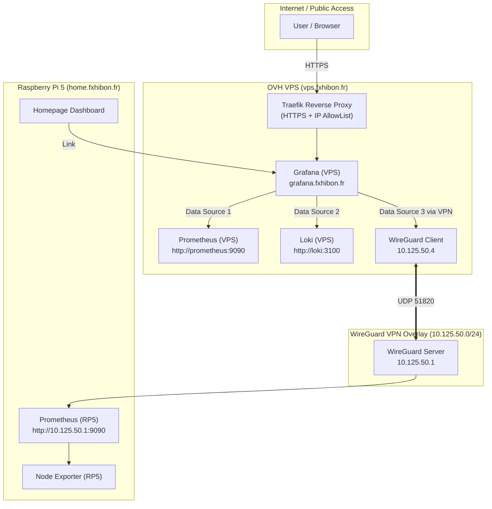

# Architecture Design Plan: Grafana Unification & Prometheus Interconnection

## Context & Objectives

Currently, the infrastructure consists of two distinct monitoring setups across two nodes:
1. **OVH VPS**: Runs Prometheus (scraping local VPS services, Traefik, containers) and Grafana (exposed at `grafana.fxhibon.fr`).
2. **Raspberry Pi 5 (RP5)**: Runs Prometheus (scraping local RP5 node-exporter) and a duplicate Grafana instance on port 3000.

### Objectives
* **Single Pane of Glass**: Unify monitoring in a single Grafana instance hosted on the VPS (`grafana.fxhibon.fr`).
* **Resource Optimization**: Remove the redundant Grafana instance from RP5 to save CPU and RAM.
* **Resilient Architecture (Option A)**: Maintain separate local Prometheus instances on VPS and RP5 for local scraping resilience, while interconnecting them through the existing WireGuard VPN.

---

## Target Architecture Diagram



---

## Detailed Specifications

### 1. WireGuard VPN Overlay (VPS ↔ RP5)

The RP5 currently acts as the WireGuard VPN Server (`10.125.50.1/24`) configured via Ansible (`infra/ansible/playbook.yml`).

* **New WireGuard Peer**: Allocate IP `10.125.50.4/32` for `vps`.
* **Secrets Management**: Store WireGuard keys (`wireguard_peer_vps_private_key`, `wireguard_peer_vps_public_key`, `wireguard_peer_vps_preshared_key`) in encrypted format within `infra/ansible/secrets.enc.yaml` using SOPS.
* **Ansible Playbook**:
  * Add WireGuard configuration generation for `vps.conf`.
  * Enable and start `wg-quick@wg0` on the `vps` host group in `playbook.yml`.

---

### 2. Grafana Provisioning (VPS)

Update the Grafana provisioning configuration at `deployments/vps/monitoring/config/grafana/provisioning/datasources/datasource.yml`:

```yaml
apiVersion: 1

datasources:
  - name: Prometheus-VPS
    type: prometheus
    access: proxy
    url: http://prometheus:9090
    isDefault: true
    editable: true

  - name: Prometheus-RP5
    type: prometheus
    access: proxy
    url: http://10.125.50.1:9090
    isDefault: false
    editable: true

  - name: Loki
    type: loki
    access: proxy
    url: http://loki:3100
    editable: true
```

#### Dashboards
* Centralize all RP5 dashboards into `deployments/vps/monitoring/dashboards/`.
* Configure dashboard template variables (`$datasource`) to seamlessly switch metrics between `Prometheus-VPS` and `Prometheus-RP5`.

---

### 3. Raspberry Pi 5 Stack Clean-up

1. **Docker Compose (`deployments/rp5/docker-compose.yml`)**:
   * Remove the `grafana` service definition.
   * Retain `prometheus`, `node-exporter`, and `alertmanager`.
2. **Homepage Updates (`deployments/rp5/homepage/config/services.yaml` & `widgets.yaml`)**:
   * Update Grafana service card and widgets to target `https://grafana.fxhibon.fr`.

---

## Implementation Checklist

- [ ] **Step 1: WireGuard Credentials & Configuration**
  - [ ] Add `wireguard_peer_vps_*` keys to `infra/ansible/secrets.enc.yaml`.
  - [ ] Update `deployments/rp5/wireguard/wg0.conf.j2` to include the VPS peer.
  - [ ] Add WireGuard setup tasks for the `[vps]` host group in `infra/ansible/playbook.yml`.

- [ ] **Step 2: VPS Grafana Provisioning**
  - [ ] Update `deployments/vps/monitoring/config/grafana/provisioning/datasources/datasource.yml`.
  - [ ] Copy and adjust RP5 dashboards to `deployments/vps/monitoring/dashboards/`.

- [ ] **Step 3: RP5 Stack Refactoring**
  - [ ] Remove `grafana` from `deployments/rp5/docker-compose.yml`.
  - [ ] Update `deployments/rp5/homepage/config/services.yaml` and `widgets.yaml`.

- [ ] **Step 4: Deployment & Verification**
  - [ ] Execute `ansible-playbook -i inventory.ini playbook.yml` to apply WireGuard configurations.
  - [ ] Run `task deploy-monitoring` to update the VPS monitoring stack.
  - [ ] Run `task deploy-rp5` to update the RP5 stack.
  - [ ] Verify WireGuard connectivity: `ping 10.125.50.1` from VPS.
  - [ ] Verify both data sources in `https://grafana.fxhibon.fr`.
